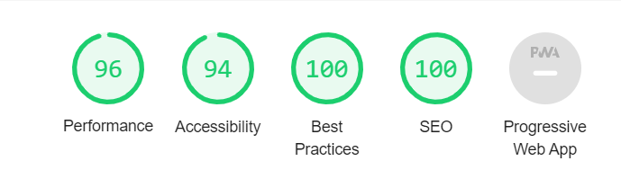
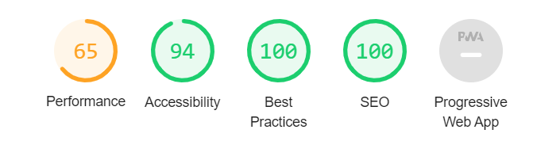

This is a [Next.js](https://nextjs.org/) project bootstrapped with [`create-next-app`](https://github.com/vercel/next.js/tree/canary/packages/create-next-app).

## Getting Started

First, run the development server:

```bash
npm run dev
```

Open [http://localhost:3000](http://localhost:3000) with your browser to see the result.

## Learn More

Too see the final result on build version;

At first, run the script below,

```bash
npm run build
```

Then run the script below and see the build result on your browser while opening [http://localhost:3000](http://localhost:3000),

```bash
npm run start
```

## Lighthouse Results

There are destop and mobile lighthouse results available and added screenshots below belong to the main page of the project.

### Desktop Results



### Mobile Results


